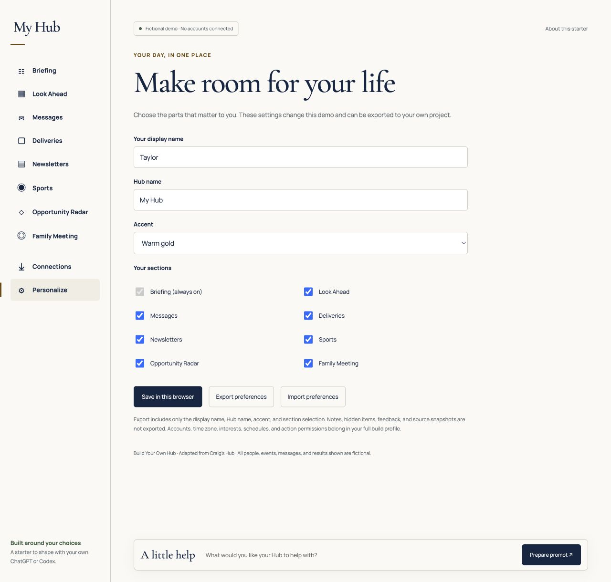
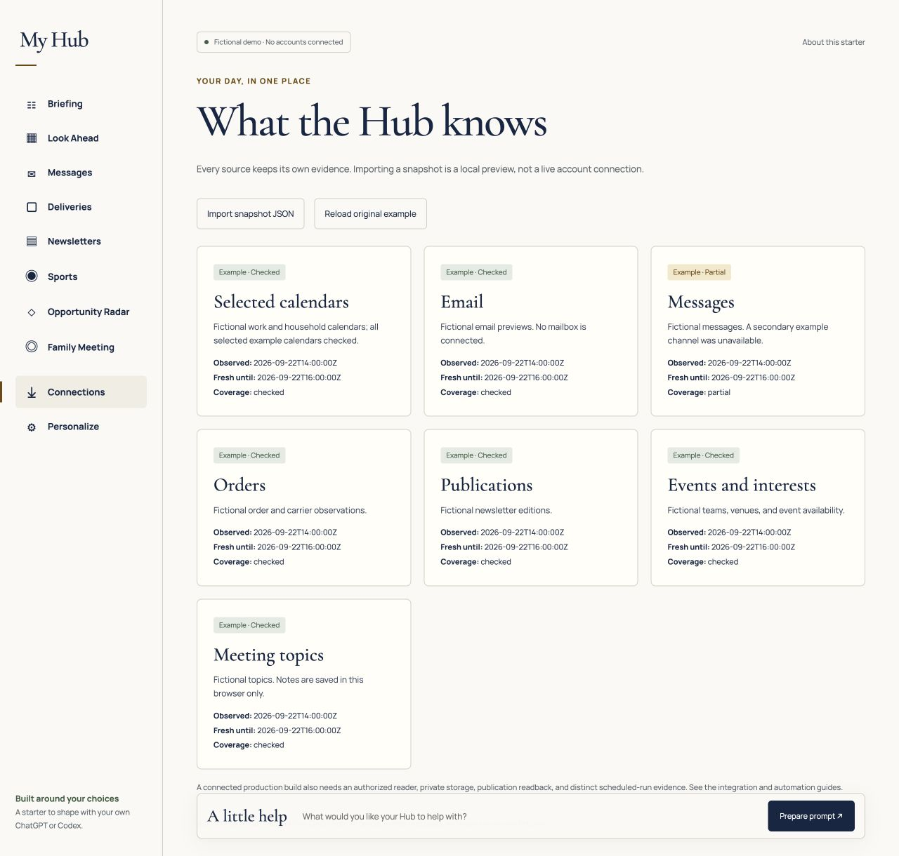
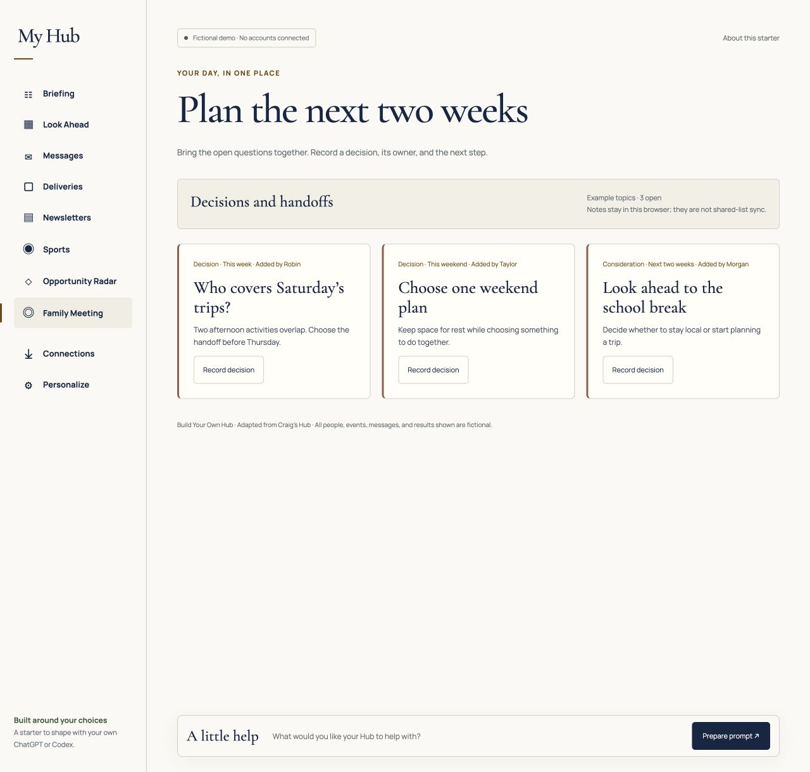
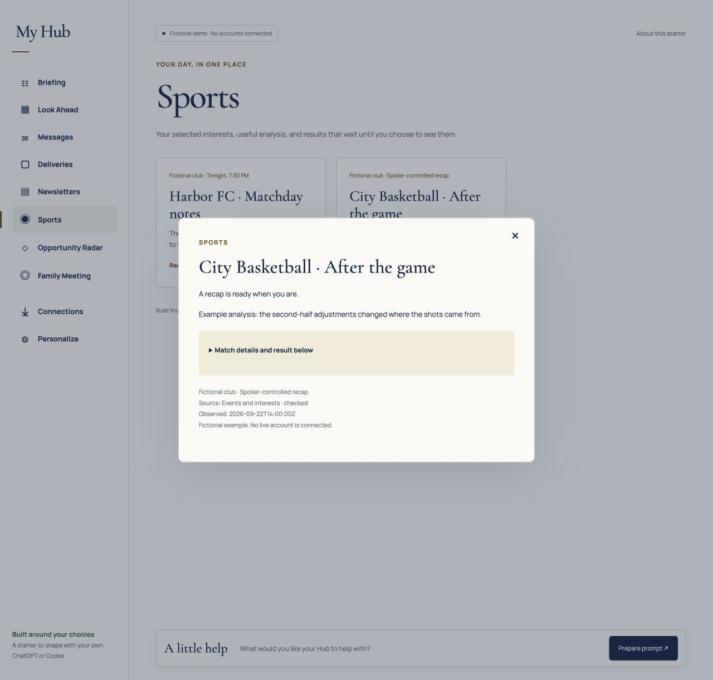
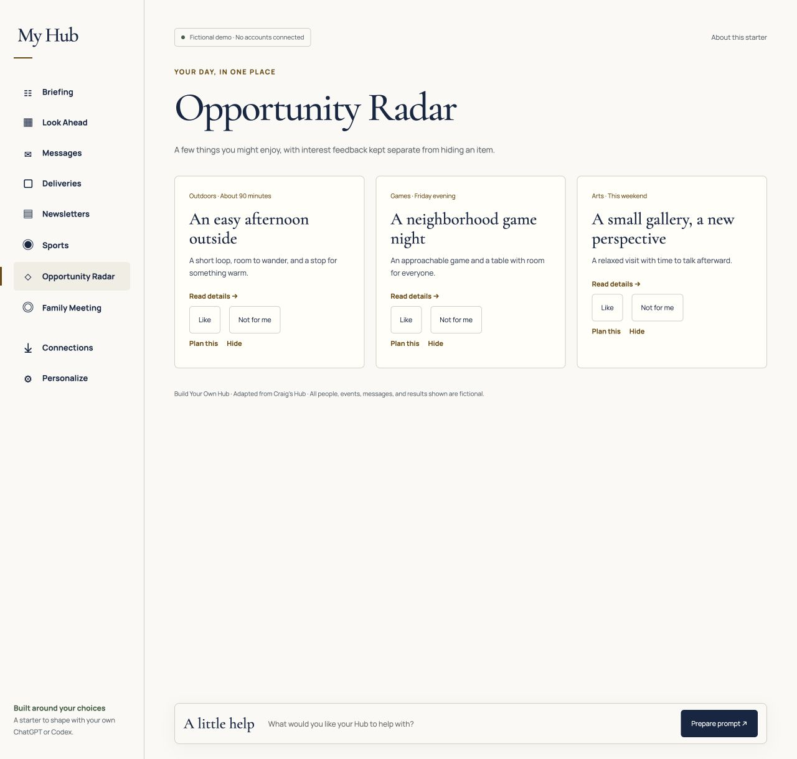
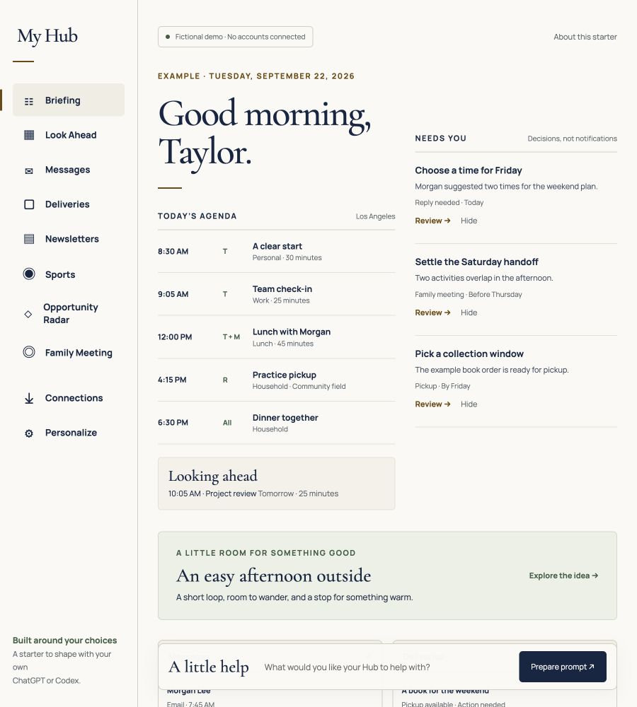
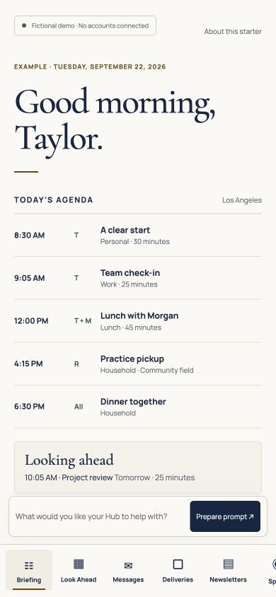
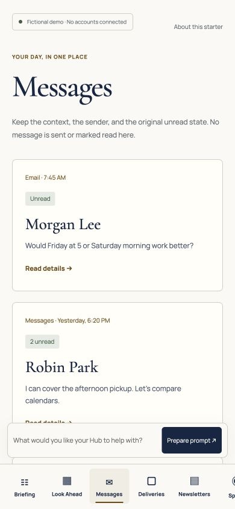

# Screenshot tour

These are browser captures of the running starter, taken on September 22, 2026. All people, messages, events, teams, results, and source states shown are fictional. They demonstrate the design and interactions; they are not screenshots of a connected personal Hub.

The desktop captures use a 1280 × 1220 viewport. Tablet uses 900 × 1000; phone uses 390 × 844. A screenshot shows one viewport, so longer pages continue below it. On a phone, the section navigation scrolls horizontally.

## The daily briefing

The agenda gives the day structure. “Needs you” contains concrete decisions. A restrained accent, serif headings, and generous space keep the page readable.

## Make it yours

Choose a display name, Hub name, accent, and sections. The demo saves these settings locally; exporting them gives your assistant a portable starting point. The full build profile adds time zone, interests, sources, and automation preferences.

## Know what was checked

Connections presents observation times, freshness, and source coverage separately. The partially checked Messages example demonstrates why a successful page load does not prove that every source was read.

## Decide together

Family Meeting gathers open decisions. Record the outcome, owner, and next step before resolving a topic. This starter saves notes in the current browser; a shared source is a later integration.

## Keep useful surprises

Sports results stay behind an explicit reveal. Opportunity Radar keeps preference feedback separate from hiding a card, so “not today” does not become “never suggest this again.”

## Smaller screens

The tablet keeps the agenda and decisions together. The phone stacks the content and moves navigation to the bottom.

| Phone briefing | Phone messages |
| --- | --- |
|  |  |

Run the demo to inspect the full pages and interaction states. Screenshots do not establish screen-reader support, native-device acceptance, or real source connectivity.
